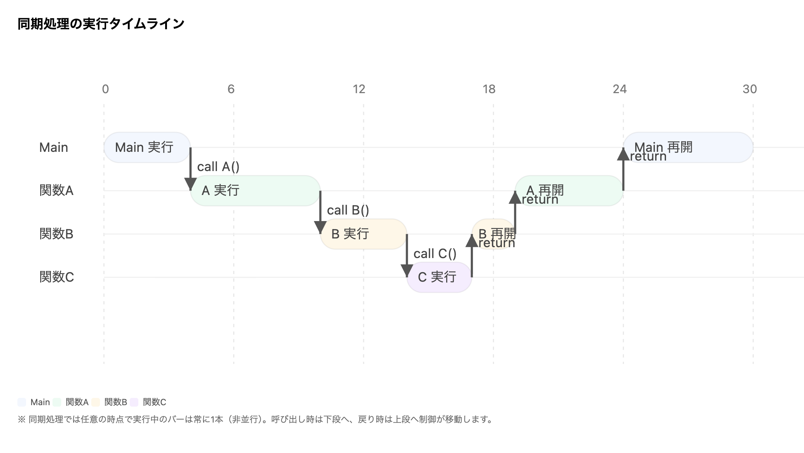
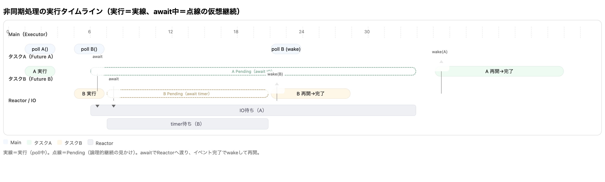

# 非同期処理ってなんだ？
普段何気なく使っている`async/await`構文、よくわからないまま使ってはいないだろうか？

「ネットワークとかなんか遅いやつはasyncってやつになってる」
「async関数ってやつはawaitをしないといけないらしい」
「Rustだとtokioってやつを使わないとasync関数のライブラリが使えない」

全て筆者が過去に思っていたことである。

`async/await`構文は非同期処理の難しさを意識することなくパフォーマンス上の利点を得られる非常に優れた概念である。
しかし、その一方で見た目上の簡単さから、非同期処理の本質を理解することを難しくしている一面もある。

そこで、本記事では非同期処理の仕組みを体感として理解するために、非同期ランタイムの自作を通じて非同期処理とは何かを学ぶことを目的とする。

(このページは基本的な概念についての説明に終始するため、適宜参照するかもしくは読み飛ばしてもらっても構わない)

## 並行と並列

非同期処理を語る前に、まず「並行（concurrency）」と「並列（parallelism）」を整理しておく。
並行は**見かけ上の同時進行**で、ひとつの計算資源（CPU コア）を細かく切り替えながら複数の仕事を少しずつ前に進めることを指す。OS のタイムスライスや、ランタイムがタスクを順に `poll` する動きは並行である。
一方、並列は**物理的な同時実行**で、複数コアや複数マシンで本当に同時に計算することを指す。SIMD やマルチスレッド、分散処理などがこれに当たる。

重要なのは、**非同期＝並行**であって、非同期の成立に並列は必須ではないことだ。単一コア上でも、I/O 待ちのあいだに別の仕事へ切り替えれば全体の待ち時間を隠せる。逆に、並列は非同期でなくても成立する。計算カーネルを複数コアで同時に走らせれば、それだけで並列である。

並行の狙いは主に**スループットと応答性の改善**だ。待ちが発生する仕事（ネットワーク、ディスク、タイマーなど）を止めたままにせず、他の仕事を前に進める。結果として、ひとつの処理の計算時間そのものは短くならなくても、全体の待ち時間が減る。並列の狙いは**計算資源の足し算**で、同じ種類の計算を同時に走らせることで処理量そのものを増やす。

この本で自作するランタイムは、まず並行の仕組みを実感するところから始める。`Future` をタスクとして持ち回り、実行できるところだけ少しずつ進め、できなくなったらいったん退く――この切り替えの繰り返しが並行である。
以降のタイムライン図でも、「同時に走っているように見える区間」が実際には高速な切り替えの結果であることを意識して見てほしい。

## 同期/非同期処理
### 同期処理
本題の非同期処理を考える前にまず**同期処理**を考えたい。

同期処理とは、処理の呼び出し元と呼び出し先の実行が同期しているものを指す。
ここでいう「同期」とは、ブロッキング・タイムライン上の非並行状態をさし、処理の終了まで待機が発生するものとなっている。

同期関数の呼び出しでは、すべての関数が呼び出した関数の処理が終わるまで（物理的・もしくは概念的に）待つのでそれぞれの処理は実行が終了するまで中断されることはなく、書いた順に上から実行される。(手続型プログラミング)

そのため、論理的な実行順序とスタック上の関数呼び出しが一致しており、非常にわかりやすい。

### 非同期処理
**非同期処理**とは処理の呼び出し元と呼び出し先の実行が同期していないものを指す。

非同期処理には実行の**中断**と**再開**が存在する。

非同期関数は処理が呼び出されても中断するべきタイミング(ネットワーク通信の開始など)が訪れたときに呼び出し元に処理を返す。
そして、実行の再開が可能になったタイミング(ネットワーク通信の完了など)で処理の再開を行う。

ユーザーレベルで非同期処理を実現する場合、処理の中断と再開を伴うと論理的な実行順序とスタック上にある関数が一致しなくなるため、実行順序の理解やデバッグが難しくなる。

## async/await構文![^1]
async/await構文は非同期処理における処理の中断と再開を同期関数の呼び出しと同様にプログラム上で扱えるようにした非常に良い概念である。
asyncは関数が非同期関数であることをマークし、async関数に対するawaitは、その時点で中断を行うということを表している。

[超わかりやすい図3]

[^1]: エイシンク/アウェイトと読む、アシンクやエイウェイトではない

